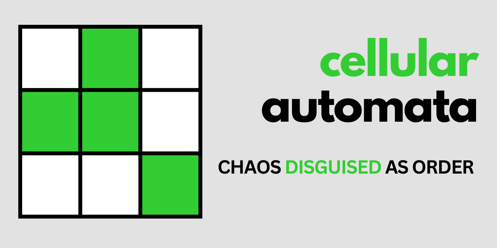

# cellular automata
A web-based simulation of different variations of Cellular Automata

## Features to add
### 🔧 Simulation Controls
- Custom rules editor (users define survival/birth rules, e.g. Life-like automata, Wolfram rules).
- Randomized initial states (seeded randomness for reproducibility).
- Step backward / undo (navigate history easily).
- Variable neighborhood sizes (Moore, Von Neumann, Hex grids).
- Toroidal / bounded edges (wrap-around vs finite world).
- Adjustable simulation speed (slow-motion vs. fast-forward).
- Multi-layered grids (stacked CA worlds that interact).

### 🎨 Visualization
- Different grid geometries (hexagons, triangles, irregular tessellations).
- Zoom & pan (explore large universes).
- Cell color mapping (e.g. intensity by age, energy, state type).
- Thematic skins (e.g. “organic” mode, “digital pixels” mode).
- Heat maps (activity, population density, entropy).

### 📊 Analysis
- Population statistics graph (live count of alive cells).
- Entropy measure (how chaotic the system is over time).
- Pattern recognizer (detect gliders, oscillators, still lifes).
- Stability detector (detect when the system freezes or loops).
- Cycle detection (recognize repeating states).
- Pattern comparison (export/import and compare runs).

### 🌍 Advanced Features
- Multi-species interactions (predator-prey, competing organisms).
- Rule evolution (rules mutate over time → evolutionary CA).
- Energy & resource fields (cells consume/regenerate resources).
- User interaction (add/remove cells live during simulation).
- Export / import state (JSON, image snapshots, animated GIFs).
- Procedural terrain generation (CA as a map generator).
- Integration with physics-like systems (diffusion, flow, heat transfer).

